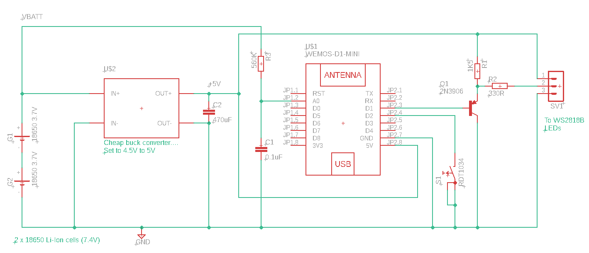
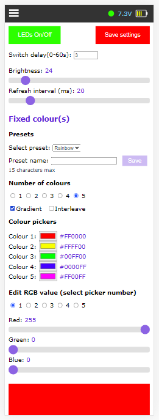
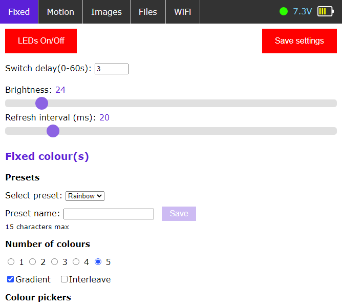
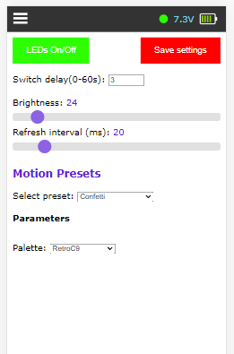
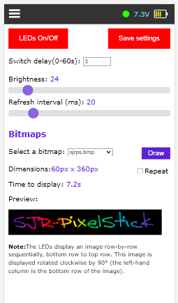
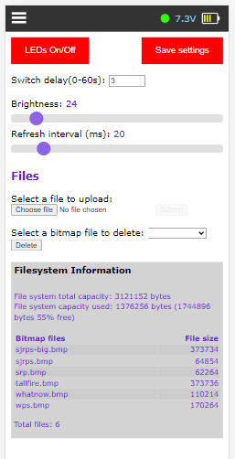
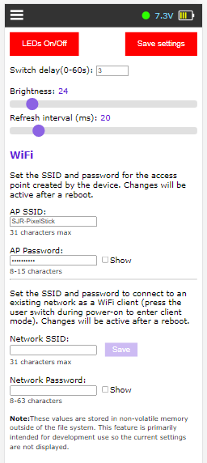

# SJR-PixelStick
This is yet another pixelstick type application, written to run on an ESP8266 chip, specifically the Wemos/Lolin D1 Mini. 

First up, let me state for the record that I am neither a C++ nor a Javascript programmer. I knew C many years ago and have used Python and Java more recently. My rusty C gradually took on some of the flavour of C++ as I was working on this, but there are no doubt weird things in here that will offend good C++ programmers. As for the Javascript, all bets are off.

## What it does

The application drives a 1m (144 LED) array of WS2812B RGB LEDs. You can choose to display either fixed patterns, motion patterns or bitmaps on the array. I looked at several other implementations before deciding how to go about this. With the exception of the libraries I used and the motion patterns (thanks to those concerned), the code is largely my own, but there are undoubtedly bits of other things in there, too.

To keep the Wifi load on the ESP8266 light, there is a single web page that is downloaded when you connect to the array, along with a .css and a .js file. All interaction is then handled in the browser and commands/data exchanged via websockets.

The LED refresh rate runs at a constant rate (eg every 20ms) but this can be varied in the interface. Some of the other apps I looked at just seem to let the refresh happen whenever it can. I wanted to have a constant, dependable rate.

## Operation

When the device is first switched on, the LEDs flash red then green then blue to show it is alive. By default it enters WAP mode and this is indicated by a brief sweep of the LEDs in green. Connect your phone/laptop to the ESP8266's wifi and access webpage 192.168.4.1. My Android phone doesn't like mDNS and I didn't want to install Bonjour but you can use **sjrps.local** if your phone does. You'll see the inteface shown below and be able to control the pixelstick from it. If you hold the user switch closed until after the intial colour flashes as you power on, the device will attempt to connect to the WiFi network using the credentials in **secrets.h**. You can change these later via the web interface. A successful connection will be indicated by a sweep of the LEDs in blue rather than green. If there's a connection failure, the device drops back to WAP mode and a green sweep is seen instead.

All communication after the web page is loaded is via websockets. The connection status is shown as a green or red indicator at the right hand end of the menu bar, next to the battery voltage indicators. The menu bar is responsive and looks a little different depending on the device you're viewing it on. If the indicator goes red for any reason, you can simply reconnect by reloading the web page. 

Once it's up and running, you control the device from the web interface. If the LEDs are off, they can be activated in the current mode by pressing the user switch. After a short delay (user settable in the interface), the LEDs will operate in the selected mode.

## Hardware

The circuit is pretty simple:

## Fixed mode

In this mode you can choose to light up the array with between 1-5 individually selectable colours. They can be either in blocks or interleaved. For example, with four colours selected, you can either have groups of 36 LEDs in each of the four colours or each LED in each group of four LEDs is lit in one of the colours. In block mode, you can choose to have either blocks of solid colours or a gradual transition from one colour to the next as you work along the row of LEDs.

 

## Motion mode

A selection of preset animations is available. Some of these presets have parameters that can be adjusted to change the way the animation runs or, perhaps, the colour palette used.

## Bitmap mode

In this mode, you can select a .bmp file stored in the ESP8266's file storage and it will be displayed column by column on the LED array (actually row by row as the image must be rotated).

## Other features

- You can upload and delete .bmp files via the web interface.
- You can change the SSID and PW needed to access the ESP8266 when in WAP mode
- You can change the SSID and PW needed to connect the ESP8266 to another network in client mode

 
